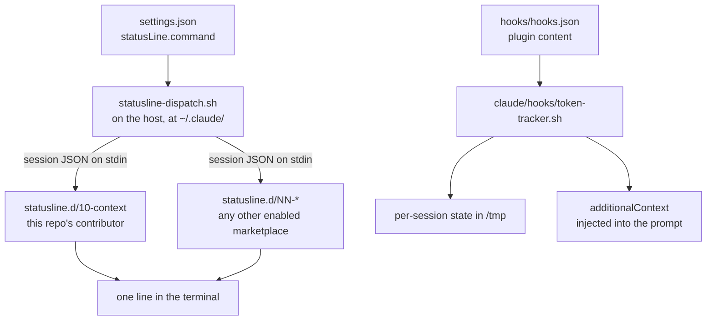

# What this repo runs on a host

Two independent mechanisms ship from here and execute on every host that installs
the plugin. One paints the line at the bottom of the terminal. The other injects
text into the model's context so it reports a number back to the reader. They
both report roughly "how full is the context window", from two different sources,
by two different routes, and they share no file, no variable and no state.

Line numbers below are a **starting point, not an address**. Jump roughly there,
confirm against what the code says, and if a range is off by more than a screen,
fix it and re-date this page.



## The statusline is composed, not owned

Claude Code renders exactly one statusline from exactly one settings value. That
value is a host path, not a plugin path — `${CLAUDE_PLUGIN_ROOT}` throws if it
appears in a `settings.json` command.

```json
"statusLine": {
  "type": "command",
  "command": "bash ~/.claude/statusline-dispatch.sh",
  "padding": 0
}
```

`claude/settings.owned.json:17`. `padding: 0` means the client adds no margin, so
a contributor owns every column it is given.

The dispatcher prints nothing of its own. It is a process supervisor: find
contributors, run them all at once under a shared budget, join what they print.

### Discovery is a directory scan, gated on consent

`claude/statusline-dispatch.sh:110` scans two roots:

```
$CLAUDE_DIR/plugins/marketplaces/<marketplace>/statusline.d/*
$CLAUDE_DIR/statusline.d/*
```

The first is gated by `enabled_marketplaces()` at `:94`, which reads
`enabledPlugins` from the host's `settings.json` and strips the plugin half of
each `plugin@marketplace` key. One enabled plugin enrols the marketplace it came
from. This gate is the point of the design: merely *adding* a marketplace must
never be enough to run its code on every render, and `enabledPlugins` is where
the human already consented. The second root is host-local and ungated.

**The executable bit is the enrolment.** The test at `:117` is
`[ -f "$file" ] && [ -x "$file" ]`, so a file present without `chmod +x` is
invisible to discovery and to everything downstream. That is deliberate: it lets
a repo park a README or a shared colour palette in `statusline.d/` beside its
contributors. It also means a contributor that ships without the mode bit fails
completely and silently — nothing on screen, nothing in the log.

Adding or removing a contributor is committing or deleting a file. There is no
install step, no manifest entry and no registration anywhere.

### Ordering is the filename

`discover()` emits `basename<TAB>fullpath` and sorts the pair, so position is a
property of the name rather than of which marketplace the file arrived from:

| range | meaning |
|---|---|
| `00`–`19` | the primary line |
| `20`–`79` | ordinary contributors |
| `80`–`99` | warnings and alerts, which belong last |

Two repos claiming the same number is a naming collision to resolve by talking,
not by mechanism; the sort breaks the tie by full path, stably and arbitrarily.

### One budget, enforced on a wall clock

`:147` launches every contributor concurrently, each with the same payload on
stdin and its own capture files, recording each PID. Concurrency turns the budget
from a sum into a wall clock — one hung contributor costs one budget, not one
budget each.

Two details there are load-bearing and look like style:

- The loop is fed by a **here-document**, not a pipe. A piped `while read` runs
  in a subshell, and the children started inside it would not be this shell's
  children to `wait` on.
- The budget is enforced by **one watchdog process** (`:166`) that forks exactly
  once, not by a poll loop on `kill -0`. On the oldest host in the fleet a fork
  costs more than the tick it is measuring: a 400 ms budget was measured at 2.2 s
  of wall clock, a fivefold divergence between the counter and reality. The
  default budget is 1 second (`:64`), sized against a measured cold start of just
  over a second on the slowest host.

A timeout is named by a **marker file**, not by exit status (`:172`). A
`kill -TERM`ed process reports 143, and so could an ordinary contributor.

### Four failure modes, none of which blanks the line

Composition is at `:204`. Each contributor's outcome is sorted into one of four
buckets:

| what happened | what the reader sees | where the detail goes |
|---|---|---|
| printed nothing | nothing | nowhere — silence is a valid answer |
| exited non-zero, or wrote to stderr | `! statusline:<name>` | the dispatcher log |
| ran past the budget | nothing | the dispatcher log |
| was not executable | nothing | nowhere — skipped at discovery |

The split between the middle two is a deliberate trade. A timeout is transient
and the next render recovers it, so raising an alarm would train the reader to
ignore the indicator. A contributor that is genuinely broken would otherwise fail
silently forever, which is the worse failure.

**The dispatcher never edits a contributor's bytes.** The only byte it removes is
the trailing newline that the join consumes. Truncation belongs to the
contributor, because cutting a string mid-ANSI-escape corrupts the colour state
of everything after it on the line.

## This repo's contributor: `statusline.d/10-context`

It reads the session JSON on stdin and prints two rows. It knows nothing about
the dispatcher, about any other contributor, or about install.

**One `jq`, not seven** (`:23`). A single pass emits every field it needs as
tab-separated values. The predecessor spent most of its 48 ms per render on
separate `jq` invocations for one field each. `@tsv` is not cosmetic: it escapes
any tab or newline inside a field, so a path cannot split the record into the
wrong number of columns.

Two fields have fallbacks that matter:

- `.workspace.current_dir // .cwd // ""` (`:31`) — older clients send only the
  second. If both are absent, no row is printed at all rather than an empty one
  (`:97`).
- `.context_window.used_percentage` is **null, not zero**, before the first API
  call of a session and again immediately after a compaction — the two moments a
  reader is most likely to be looking at the line. `// 0` prevents the crash, and
  `:41`–`:44` recovers a real number from the token totals when it can.

Width is the contributor's problem. `COLUMNS` is exported into its environment
precisely because `tput cols` cannot work from inside a captured subprocess —
there is no terminal on the far end of that pipe. `trim_left()` at `:77` keeps
the **tail** of a path and elides the head, because the leaf is what identifies a
directory. The elision marker measures itself with `${#ELIDE}` rather than
assuming a width: `…` is one character under a UTF-8 locale and three bytes
without one, and a statusline inherits whatever locale the session was launched
with, so a hard-coded `1` overruns by two columns on any host with a bare
environment.

Row one ends in `\n`; row two does not (`:103`). That asymmetry is the interface
to the alert range — because the dispatcher's join inserts no newline either, a
contributor numbered `80`–`99` lands on the right of row two instead of claiming
a row of its own.

## The hooks are a separate machine

Nothing in this section touches the statusline.

`hooks/hooks.json` at the plugin root is discovered by filename; no manifest key
points at it. It binds the same script to two events with a different argument:

| event | fires | argument |
|---|---|---|
| `UserPromptSubmit` | once, when the human submits a prompt | `UserPromptSubmit` |
| `PostToolUse` | after every single tool call | `PostToolUse` |

Both carry `"timeout": 5`. Every performance decision in the script is measured
against that ceiling. Both address the script through `${CLAUDE_PLUGIN_ROOT}`, so
what runs is published plugin content rather than anyone's working copy.

> A plugin hook **merges** with a `settings.json` hook of the same event, it does
> not override it. Adding a binding here without deleting the matching
> `settings.json` entry makes it fire twice per event, with no error anywhere.

### What the tracker does

`claude/hooks/token-tracker.sh` parses the session transcript and reports how
full the context window is. Its whole design problem is staying under five
seconds on a transcript that grows all session.

**State is per session** (`:74`). The key is derived from the payload's session
id, falling back to a hash of the transcript path and then to the literal
`default`. It is passed through `tr -cd 'A-Za-z0-9._-'`, which is a containment
control rather than tidiness: with no `/` possible the key cannot escape the
temporary directory whatever the payload contains. Three files hang off that key
— a human-readable summary, a structured JSON blob, and a one-line snapshot.
Sessions run in parallel, and a single shared state file would have them
clobbering each other's arithmetic continuously.

**The read is bounded** (`:162`). The structured file carries a watermark: how
many transcript lines the previous invocation had already consumed. This
invocation starts exactly there, so cost is proportional to new activity rather
than to session length. Cumulative totals stay exact because they are carried
forward and added to (`:230`), never recomputed.

Three guards keep that honest:

- A `cksum` of the first 2 KB of the transcript is stored as `head_sig` (`:130`).
  If the file is ever rewritten in place rather than appended to — a compaction,
  a rewind — the signature changes, the guard at `:145` rejects the stale state,
  and the whole file is rescanned.
- A cold start reads the entire file only up to a 128 MB ceiling (`:46`), chosen
  because a streaming `jq` over 64 MB measured about 0.75 s, leaving more than
  three seconds of the five-second timeout as margin. Beyond it the script seeds
  from the last 400 lines and sets `cumulative_complete: false` in its output —
  it reports a number it knows is partial and says so, rather than quietly lying.
- `head -n "$delta_lines"` after the `tail` (`:184`) looks redundant and is not.
  It drops any partial trailing line the writer is still flushing, which keeps
  the watermark on a complete-line boundary. Without it one half-written record
  would corrupt the next invocation's arithmetic.

Concurrent invocations within one session are serialised with `mkdir`, not
`flock` (`:103`). `mkdir` is atomic on every filesystem and available on every
host; `flock` is a Linux binary that macOS does not ship, so an earlier
`command -v flock` guard silently left every macOS client in the fleet with no
lock at all, and no error to notice.

### Two numbers, and why they differ so much

`current_context` (`:222`) is a **snapshot**: what the single most recent API
call consumed, summing input, both cache figures and output. `total_session`
(`:237`) is a **lifetime sum** across every call. Observed on one ordinary
session of twenty-six assistant turns:

```json
{
  "current_context": 50385,
  "total_session": 1080339,
  "cumulative_cache_read": 972025,
  "turn_count": 26,
  "cumulative_complete": true,
  "scan_lines": 134
}
```

A twenty-one-fold gap, almost all of it cache reads. That is why both are
tracked: one answers "will this fit", the other answers "what did this cost".
`scan_lines` is the watermark — the next invocation begins at line 135.

### How a shell script gets a sentence into the model

The script's stdout is JSON with an `additionalContext` field (`:312`), which is
injected into the prompt as though the system had said it. On
`UserPromptSubmit` that string carries a standing instruction to report the
running figure to the reader; on `PostToolUse` it is the bare context line
(`:299`).

That asymmetry is a cost decision. The instruction ships once per turn. Repeating
seven lines of directive on every tool call — of which there may be dozens per
turn — would cost more tokens than the measurement it delivers.

## The general rule

Both halves are built the same way, and it is the shape worth carrying forward:
**registration is a filesystem fact, not a configuration entry.** A statusline
contributor enrols by existing and being executable; a hook binds by living at a
known filename. Nothing keeps a list, so nothing can hold a stale one, and two
independent parties can add and remove their own pieces without ever editing the
same file. The cost of that shape is that a mistake in the filesystem fact — a
missing mode bit, a file in the wrong directory — produces no error message at
all, only absence. When something shipped here is simply not happening, check
that the file is where the scan looks and that it is executable, before reading
any of its code.
