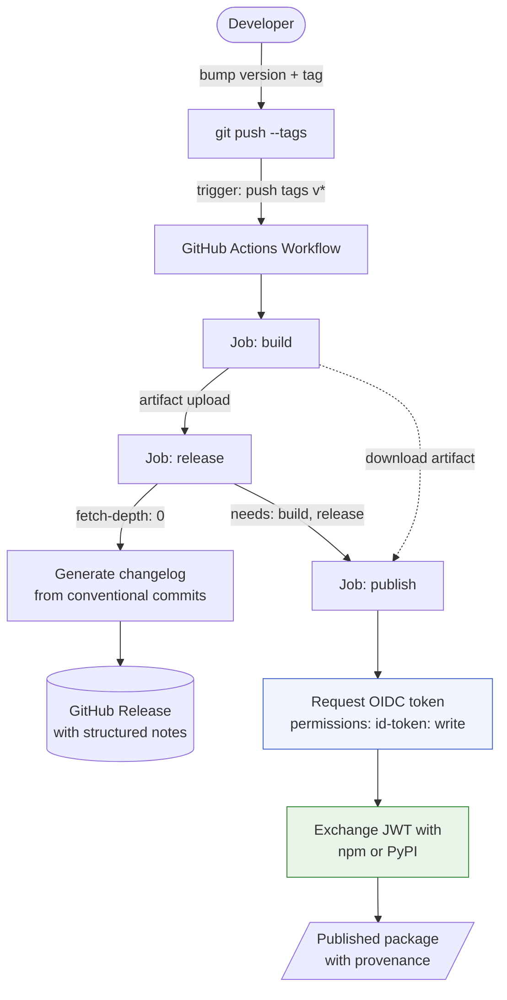

# Release — Tag → Release → Publish

> **When to use:** Shipping a release (any project), setting up release infrastructure
> on a new repo, or auditing CI/CD patterns. Covers the full loop from draft notes
> through tag creation to registry publish.

---

## Agent Playbook — How to Execute a Release

When the user says "release this as a patch" or "ship vX.Y.Z", follow this sequence.

### Step 0: Discover the repo's release pattern (NON-NEGOTIABLE)

**Never draft notes, bump versions, or tag before completing this step.** Assuming a generic "bump + tag + push" flow without checking is the #1 way to skip a required `releases/vX.Y.Z.md` or CHANGELOG entry and ship a broken CI run.

```
1. Check for releases/ dir          → narrative per-file (Pattern C) — REQUIRES hand-written file
2. Check for .github/workflows/     → find the release trigger (tag push? workflow_dispatch?)
                                       If the workflow greps `releases/${tag}.md`, missing file = failed build
3. Check releases/README.md         → authoring conventions, index of past releases
4. Read the most recent releases/vX.Y.Z.md → note mechanical conventions ONLY (naming, index format). Do NOT match voice or length — this skill's brief + scannable format OVERRIDES legacy notes (see Format Mandate)
5. Check CHANGELOG.md (root or subdir) → some repos maintain this ALONGSIDE releases/
6. Check CLAUDE.md for a `Releases:` line → repo-specific rules (e.g. "bump sub-package separately from repo tag")
7. If none exist                    → set up from scratch using templates below
```

### Step 1: Determine version

```
- Read releases/README.md index (or git tag -l) to find the latest version
- Bump per user intent: patch (0.2.2→0.2.3), minor (0.2.2→0.3.0), major (0.2.2→1.0.0)
- If the repo has package.json or pyproject.toml, bump that too
```

### Step 2: Draft release notes

For narrative repos: write `releases/vX.Y.Z.md` following the structure in §Pattern C below.
For auto-parsed repos: skip — CI generates notes from conventional commits.

Update `releases/README.md` index table with the new entry.

### Step 3: Commit and push

**Gate:** run the 🚨 pre-flight leak & secret scan (section below) on the notes + staged diff first — scrub secrets, resolve private gsd-lite notation to plain English, genericize sensitive info.

```bash
git add releases/vX.Y.Z.md releases/README.md [package.json|pyproject.toml]
git commit -m "docs(release): add vX.Y.Z release notes"
git push origin <branch>
```

### Step 4: Create tag

**Try local first, fall back to API:**

```bash
git tag vX.Y.Z && git push origin vX.Y.Z
```

If `git push` returns HTTP 403 (cloud session proxy limitation), create the tag via GitHub API using `gh-cli`:

```
# Via MCP proxy (native mode)
utils:gh-cli__shell_execute({
  command: ["gh", "api", "-X", "POST",
            "/repos/OWNER/REPO/git/refs",
            "-f", "ref=refs/tags/vX.Y.Z",
            "-f", "sha=<commit-sha>"],
  directory: "/workspace"
})

# Via daemon (cloud mode)
curl -s localhost:<port>/call -d '{
  "method": "call_tool_destructive",
  "name": "utils:gh-cli__shell_execute",
  "args": {"command": ["gh","api","-X","POST",
           "/repos/OWNER/REPO/git/refs",
           "-f","ref=refs/tags/vX.Y.Z",
           "-f","sha=COMMIT_SHA"],
           "directory": "/workspace"},
  "reason": "create tag for release"
}'
```

### Step 5: Verify workflow fired

```
# Check workflow status
gh run list --repo OWNER/REPO --workflow release.yaml --limit 3
```

Or via gh-cli shell_execute if not local. Expect `completed/success` within ~30s for narrative-only releases.

### Step 6: Open PR (if on a branch)

```
gh pr create --base main --head <branch> --title "..." --body "..."
```

### Gotchas learned the hard way

| Gotcha | Workaround |
|--------|-----------|
| Cloud git proxies 403 on tag pushes | Use `gh api /repos/.../git/refs` instead (Step 4 fallback) |
| `docker compose restart` doesn't re-read `env_file` | Use `docker compose up -d --force-recreate` after rotating PAT |
| `gh release create --generate-notes` produces empty stubs | Always use `--notes-file` with a hand-written file |
| Rebasing can clobber another session's release notes | Check `releases/README.md` index for versions you don't know about before picking a version number |

---

## 🚨 CRITICAL — Pre-flight leak & secret scan (before commit AND before tag)

`releases/` is **world-readable and permanent.** Scan the release diff AND your draft notes before committing, and again before tagging. Three classes to catch — applies to BOTH narrative and auto-parsed patterns (commit-message notes leak just as easily):

- **Secrets / credentials** — tokens, API keys, passwords, connection strings, `.env` values, basic-auth in URLs, private keys. **Scrub entirely** — never publish, even redacted-looking. If a secret already reached a commit, rotate it.
- **Private gsd-lite notation** — `LOG-NNN`, `TASK-NNN`, `WORK.md §N`, gsd-lite paths. The reader can't follow these (`gsd-lite/` is gitignored). **Resolve to plain English** + the underlying fact.
- **Sensitive / internal info** — client names under NDA, internal hostnames/IPs, employee data, anything that shouldn't leave the org. **Genericize or omit.**

Fast net, then eyeball:

```bash
rg -nI 'LOG-[0-9]|TASK-[0-9]|WORK\.md|gsd-lite/|password|secret|token|api[_-]?key|-----BEGIN' releases/vX.Y.Z.md $(git diff --cached --name-only)
```

The regex is a net, not a guarantee — read the draft once more for a leaked client name or hostname it won't catch. **When in doubt, leave it out.**

---

## Release Notes — Pick One Before Copying a Workflow

This skill ships TWO release-notes patterns. They're not interchangeable — decide upfront.

| Pattern | Storage | Voice | Maintenance | Audience | When to use |
|---|---|---|---|---|---|
| **Narrative per-file** (🌟 preferred) | `releases/vX.Y.Z.md` in repo | Brief scannable bullets, no diagrams | Hand-written per release | Future agents probing project growth | Any repo where a later session needs to know what each version changed and why |
| **Auto-parsed conventional commits** | Generated in CI from git log | Categorized bullet list | Zero (parses commit prefixes) | Machine-readable changelog | Repos with strict `feat:/fix:/chore:` discipline where even a 2-line hand summary isn't worth it |

**Rule of thumb:** If a future agent should be able to skim `releases/` and reconstruct how the project grew, pick narrative (kept brief). If releases exist only to mark CI deploy points, pick auto-parsed.

**Both patterns share the same build+publish jobs.** Only the `release` job differs — see §Pattern C (narrative) or the inline `release` job in §Pattern A/B (auto-parsed).

## Quick Reference

```
Developer flow:  edit code → bump version → commit → git tag vX.Y.Z → git push --tags
CI does:         build (once) → release → publish (same artifact throughout)
Auth:            GitHub OIDC token → exchanged with npm/PyPI Trusted Publisher
```

## Architecture (Both Ecosystems)



---

## Decision: Why OIDC Trusted Publishers

| Approach | Secrets to manage | Token rotation | Supply chain | Setup |
|----------|-------------------|----------------|--------------|-------|
| **OIDC Trusted Publisher** ✅ | Zero | Automatic (short-lived JWT) | Provenance attestation | One-time web config |
| Classic API token | 1 per registry | Manual, expires | No provenance | Repo secret + rotation |
| `python-semantic-release` | 1+ | Manual | Optional | Complex config |

**We chose OIDC because:** zero secret management, built-in provenance, and the trust
relationship is configured once on the registry side (npm/PyPI), not in repo settings.

---

## Pattern A: npm (Node.js / TypeScript)

### Workflow Template: `.github/workflows/publish.yml`

```yaml
name: Publish to npm

on:
  push:
    tags:
      - 'v*'

permissions:
  contents: write
  id-token: write

jobs:
  build:
    runs-on: ubuntu-latest
    steps:
      - uses: actions/checkout@v4
      - uses: actions/setup-node@v4
        with:
          node-version: 22
          # ⚠️ Do NOT set registry-url here — it injects NODE_AUTH_TOKEN
          # placeholder which poisons OIDC auth (actions/setup-node#1440)
      - run: npm ci
      - run: npm run build
      - name: Verify version matches tag
        run: |
          TAG_VERSION="${GITHUB_REF_NAME#v}"
          PKG_VERSION=$(node -p "require('./package.json').version")
          if [ "$TAG_VERSION" != "$PKG_VERSION" ]; then
            echo "::error::Tag ($TAG_VERSION) != package.json ($PKG_VERSION). Bump version before tagging."
            exit 1
          fi
      - run: npm pack --dry-run
      - name: Upload build artifact
        uses: actions/upload-artifact@v4
        with:
          name: dist
          path: "*.tgz"

  release:
    runs-on: ubuntu-latest
    needs: build
    permissions:
      contents: write
    steps:
      - uses: actions/checkout@v4
        with:
          fetch-depth: 0
      - name: Generate structured release notes
        run: |
          PREV_TAG=$(git describe --tags --abbrev=0 HEAD^ 2>/dev/null || echo "")
          TAG="${{ github.ref_name }}"
          {
            if [ -z "$PREV_TAG" ]; then
              echo "🎉 Initial release"
            else
              echo "## What's Changed"
              echo ""
              # Categorize by conventional commit prefix
              for prefix_label in "feat:✨ Features" "fix:🐛 Bug Fixes" "perf:⚡ Performance" "docs:📖 Documentation"; do
                prefix="${prefix_label%%:*}"
                label="${prefix_label#*:}"
                items=$(git log "$PREV_TAG..$TAG" --format="- %s (%h)" --grep="^${prefix}" 2>/dev/null || true)
                if [ -n "$items" ]; then
                  echo "### $label"
                  echo "$items"
                  echo ""
                fi
              done
              # Uncategorized (chore, ci, refactor, etc.)
              uncategorized=$(git log "$PREV_TAG..$TAG" --format="- %s (%h)" \
                --invert-grep --grep="^feat" --grep="^fix" --grep="^perf" --grep="^docs" 2>/dev/null || true)
              if [ -n "$uncategorized" ]; then
                echo "### 🔧 Other Changes"
                echo "$uncategorized"
                echo ""
              fi
              echo "### 📊 Diff Summary"
              echo '```'
              git diff --stat "$PREV_TAG..$TAG" | tail -1
              echo '```'
              echo ""
              echo "**Full Changelog**: https://github.com/${{ github.repository }}/compare/${PREV_TAG}...${TAG}"
            fi
          } > /tmp/release-body.md
      - name: Create GitHub Release
        env:
          GH_TOKEN: ${{ github.token }}
        run: |
          gh release create "${{ github.ref_name }}" \
            --title "${{ github.ref_name }}" \
            --notes-file /tmp/release-body.md

  publish:
    runs-on: ubuntu-latest
    needs: [build, release]
    permissions:
      id-token: write
      contents: read
    steps:
      - uses: actions/checkout@v4
      - uses: actions/setup-node@v4
        with:
          node-version: 22
      - run: npm ci
      - run: npm run build
      - name: Determine npm dist-tag
        id: dist-tag
        run: |
          TAG="${GITHUB_REF_NAME:-manual}"
          if [[ "$TAG" =~ -dev\. ]]; then
            echo "tag=dev" >> "$GITHUB_OUTPUT"
          elif [[ "$TAG" =~ -(rc|beta|alpha)\. ]]; then
            echo "tag=next" >> "$GITHUB_OUTPUT"
          else
            echo "tag=latest" >> "$GITHUB_OUTPUT"
          fi
      - name: Publish to npm (OIDC provenance)
        run: npx -y npm@latest publish --access public --provenance --tag ${{ steps.dist-tag.outputs.tag }}
        # ⚠️ npx npm@latest avoids Node 22 global npm install bug (promise-retry MODULE_NOT_FOUND)

  # Optional: PR preview publishing
  # preview:
  #   if: github.event_name == 'pull_request'
  #   runs-on: ubuntu-latest
  #   steps:
  #     - uses: actions/checkout@v4
  #     - uses: actions/setup-node@v4
  #       with:
  #         node-version: 22
  #     - run: npm ci
  #     - run: npm run build
  #     - run: npx pkg-pr-new publish --compact --bin
```

### npm OIDC Setup (One-Time)

1. Go to **npmjs.com → Package Settings → Publishing access**
2. Add a **Linked Provider**: GitHub Actions
3. Configure trust:
   - Repository: `your-org/your-repo`
   - Workflow filename: `publish.yml`
   - Environment: *(leave blank — no GHA environment needed)*
4. That's it — no npm token, no repo secret

### npm Dist-Tag Routing

| Git tag pattern | npm dist-tag | Install command |
|-----------------|-------------|-----------------|
| `v1.0.0` | `latest` | `npm install pkg` |
| `v1.0.0-dev.1` | `dev` | `npm install pkg@dev` |
| `v1.0.0-rc.1` | `next` | `npm install pkg@next` |
| `v1.0.0-beta.1` | `next` | `npm install pkg@next` |

---

## Pattern B: PyPI (Python)

### Workflow Template: `.github/workflows/release.yaml`

```yaml
name: Publish to PyPI

on:
  push:
    tags:
      - 'v*'

permissions:
  contents: write
  id-token: write

jobs:
  build:
    runs-on: ubuntu-latest
    steps:
      - uses: actions/checkout@v4
      - uses: actions/setup-python@v5
        with:
          python-version: '3.11'
      - run: pip install build twine
      - name: Verify version matches tag
        run: |
          TAG_VERSION="${GITHUB_REF_NAME#v}"
          PKG_VERSION=$(python -c "import tomllib; print(tomllib.load(open('pyproject.toml','rb'))['project']['version'])")
          if [ "$TAG_VERSION" != "$PKG_VERSION" ]; then
            echo "::error::Tag ($TAG_VERSION) != pyproject.toml ($PKG_VERSION). Bump version before tagging."
            exit 1
          fi
      - run: python -m build
      - run: twine check dist/*
      - name: Upload dist artifact
        uses: actions/upload-artifact@v4
        with:
          name: dist
          path: dist/

  release:
    runs-on: ubuntu-latest
    needs: build
    permissions:
      contents: write
    steps:
      - uses: actions/checkout@v4
        with:
          fetch-depth: 0
      - name: Generate structured release notes
        run: |
          PREV_TAG=$(git describe --tags --abbrev=0 HEAD^ 2>/dev/null || echo "")
          TAG="${{ github.ref_name }}"
          {
            if [ -z "$PREV_TAG" ]; then
              echo "🎉 Initial release"
            else
              echo "## What's Changed"
              echo ""
              for prefix_label in "feat:✨ Features" "fix:🐛 Bug Fixes" "perf:⚡ Performance" "docs:📖 Documentation"; do
                prefix="${prefix_label%%:*}"
                label="${prefix_label#*:}"
                items=$(git log "$PREV_TAG..$TAG" --format="- %s (%h)" --grep="^${prefix}" 2>/dev/null || true)
                if [ -n "$items" ]; then
                  echo "### $label"
                  echo "$items"
                  echo ""
                fi
              done
              uncategorized=$(git log "$PREV_TAG..$TAG" --format="- %s (%h)" \
                --invert-grep --grep="^feat" --grep="^fix" --grep="^perf" --grep="^docs" 2>/dev/null || true)
              if [ -n "$uncategorized" ]; then
                echo "### 🔧 Other Changes"
                echo "$uncategorized"
                echo ""
              fi
              echo "### 📊 Diff Summary"
              echo '```'
              git diff --stat "$PREV_TAG..$TAG" | tail -1
              echo '```'
              echo ""
              echo "**Full Changelog**: https://github.com/${{ github.repository }}/compare/${PREV_TAG}...${TAG}"
            fi
          } > /tmp/release-body.md
      - name: Create GitHub Release
        env:
          GH_TOKEN: ${{ github.token }}
        run: |
          gh release create "${{ github.ref_name }}" \
            --title "${{ github.ref_name }}" \
            --notes-file /tmp/release-body.md

  publish:
    runs-on: ubuntu-latest
    needs: [build, release]
    permissions:
      id-token: write
      contents: read
    steps:
      - name: Download dist artifact
        uses: actions/download-artifact@v4
        with:
          name: dist
          path: dist/
      - name: Publish to PyPI (OIDC)
        uses: pypa/gh-action-pypi-publish@release/v1
        with:
          skip-existing: true
        # No password/token — OIDC Trusted Publisher handles auth
```

### PyPI OIDC Setup (One-Time)

1. Go to **pypi.org → Your Project → Settings → Publishing**
2. Add a **Trusted Publisher**:
   - Owner: `your-github-username`
   - Repository: `your-repo-name`
   - Workflow name: `release.yaml`
   - Environment: *(leave blank)*
3. Done — no `PYPI_TOKEN` secret needed

**For first-time packages** (not yet on PyPI): Use PyPI's "Pending Publisher" feature.
Go to pypi.org → Publishing → Add Pending Publisher with the same fields. The first
push of a `v*` tag will create the package automatically.

---

## Pattern C: Narrative Release Notes (per-file) 🌟

**Preferred pattern.** Ship a hand-written `releases/vX.Y.Z.md` file in the repo, have CI publish it verbatim via `gh release create --notes-file`.

### 🚨 FORMAT MANDATE — brief AND scannable

The audience is **a future agent probing how the project grew**, not a human reading a pitch. But brief ≠ a wall of prose — even a short dense paragraph is hard to read. Optimize for a 10-second scan.

**Shape:**
- **Title** — `# vX.Y.Z — <one-line theme>`
- **Bullets, one per change** — `**what changed** — why it mattered`. This is the body. No prose paragraphs.
- **`##` mini-headers** only when there are 2+ distinct areas; otherwise a flat bullet list.

**Limits:**
- **No diagrams** — no Mermaid, no ASCII, no screenshots. Ever.
- **No multi-section anatomy** — no TL;DR / Why / Highlights / Before-After / Config / Upgrade scaffolding.
- **~8 bullets max.** More than that means the release is too big or you're over-explaining — push detail to the commit body or `gsd-lite/`.

**This format OVERRIDES the repo's existing release voice.** If a repo's `releases/` history is hundreds of lines of pitch prose and diagrams, do NOT match it — that legacy is exactly what you're correcting. Reuse past releases only for mechanical conventions (file naming, the index table); never for length or tone.

Model entry:

```markdown
# v1.4.0 — auth tokens auto-refresh

- **Background creds poller** — running sessions pick up rotated OAuth tokens with no manual re-login; fixes the stale-refresh-token failure on account switch.
- **Active-label tracking** — the UI keeps the correct account identity across a rotation instead of blanking out.
- **Config:** new `POLL_INTERVAL_SEC` (default 900). No action on upgrade.
```

### Why Not `--generate-notes`

`gh release create --generate-notes` produces PR-title bullets. Examples from real repos:

- `mcp-proxy-shim v1.4.1` release body in full: `**Full Changelog**: v1.4.0...v1.4.1` — literally nothing else.
- Straight-to-main repos produce empty stubs because there are no merged PRs to enumerate.

The categorized-commits pattern (§Pattern A/B) is one step better, but still a mechanical bullet list with no narrative arc, no diagrams, no before/after example, and no "why this exists."

### Why Per-File Beats a Monolithic CHANGELOG.md

- **Conflict-free across parallel branches** — two PRs writing to the same CHANGELOG.md always conflict; two PRs writing `releases/v1.5.0.md` and `releases/v1.6.0.md` don't.
- **Cold-reader friendly** — each file is self-contained. No scrolling past 80 other releases to find the one you care about.
- **Git archaeology friendly** — `git log releases/v1.5.0.md` shows exactly who touched one release's story.
- **Append-only by construction** — no "update overhaul" temptation. README-style files rot; release files don't.

### Directory Layout

```
repo/
├── releases/
│   ├── README.md          # Authoring index + pattern docs
│   ├── v1.5.0.md          # One file per release
│   ├── v1.4.0.md
│   └── ...
├── .github/workflows/
│   └── publish.yml        # Reads releases/${{ github.ref_name }}.md
```

### Anatomy of a Brief Entry

1. **Title** — `# vX.Y.Z — <one-line theme>`
2. **Body** — short bullets, one per change (`**what** — why`). A flat list, or grouped under `##` mini-headers if there are 2+ areas.

Nothing else — no diagrams, no scaffolding, no before/after walkthroughs. If a fact isn't load-bearing for "what did this version do and why," cut it; long reasoning lives in the commit body or `gsd-lite/`. Voice: factual, not pitch — summarize the arc, don't transcribe the commit log.

### Workflow Template: `.github/workflows/publish.yml` (release job only)

Replace the `release` job from Pattern A/B with this:

```yaml
  release:
    runs-on: ubuntu-latest
    needs: build
    permissions:
      contents: write
    steps:
      - uses: actions/checkout@v4
      - name: Verify release notes file exists
        run: |
          NOTES_FILE="releases/${{ github.ref_name }}.md"
          if [ ! -f "$NOTES_FILE" ]; then
            echo "::error::Missing $NOTES_FILE. Every tag needs a hand-written narrative entry."
            echo "::error::See releases/README.md for the authoring pattern."
            exit 1
          fi
          echo "Found $NOTES_FILE ($(wc -l < $NOTES_FILE) lines)"
      - name: Create GitHub Release from narrative notes file
        env:
          GH_TOKEN: ${{ github.token }}
        run: |
          gh release create "${{ github.ref_name }}" \
            --title "${{ github.ref_name }}" \
            --notes-file "releases/${{ github.ref_name }}.md"
```

**Key design choice:** fail loudly if the file is missing. No `--generate-notes` fallback — an empty stub release defeats the point of the pattern. This forces authors to write the file before tagging.

### `releases/README.md` Index Template

Ship this alongside the first release file so future contributors find the pattern:

```markdown
# Release Notes Index

Append-only narrative release notes for `<package-name>`.

## Authoring
- **One file per release.** Name: `vX.Y.Z.md`. No overwrites.
- **Audience:** a future agent reconstructing how the project grew — not a human reading a pitch.
- **Format:** title line + short bullets (one per change, `**what** — why`). Scannable in ~10s. No prose paragraphs, no diagrams, ~8 bullets max.
- **This format wins over legacy notes** — if older entries run long or pitchy, don't match them; reuse past files only for naming + index conventions.
- **Voice:** plain and factual. Long reasoning goes in the commit body or `gsd-lite/`.
- **Pre-flight scan (REQUIRED)** — before committing, scrub secrets/creds and resolve private gsd-lite notation (`LOG-NNN`, `WORK.md §N`) to plain English; `releases/` is world-readable and permanent.

## Publishing
The `publish.yml` workflow reads `releases/${{ github.ref_name }}.md` via
`gh release create --notes-file` when a tag is pushed. Missing file → workflow fails loudly.

## Index
| Version | Date | Theme |
|---|---|---|
| [v1.5.0](./v1.5.0.md) | YYYY-MM-DD | One-line theme |
```

### No diagrams in release bodies

Release notes carry no Mermaid, no ASCII art, no screenshots. The reader is a future agent reconstructing project growth — it doesn't need a diagram, and nobody reads one in a release body. If a flow genuinely needs a picture, it belongs in the code/docs or `gsd-lite/`, referenced in plain text, never pasted into the release note.

### Canonical Example

The model entry under the Format Mandate above is the canonical shape: a title line plus a few short bullets, scannable at a glance. If a draft reads as a paragraph or runs past ~8 bullets, restructure or cut.

### Working with Agents

The per-file pattern plays naturally with agentic workflows:

- **Drafting:** tell the agent "draft `releases/vX.Y.Z.md` — we shipped X that solves Y"; the agent pulls context from `gsd-lite/` but keeps the body brief, bulleted, and scrubbed of private notation/secrets.
- **Consistency:** the agent follows THIS skill's format, not the repo's legacy voice — grep past `releases/*.md` only for naming + index conventions, never to imitate length or tone.
- **Review:** the PR diff on `releases/vX.Y.Z.md` is the exact release body — no surprises at tag-push time.

---

## Release Notes: Auto-Parsed Conventional Commits (Pattern A/B built-in)

### Problem with `--generate-notes`

GitHub's `--generate-notes` produces bare PR titles or commit subjects — no context,
no categorization, no diff stats. Example of what it produces:

```
## What's Changed
* ci: ditch semantic-release, switch to tag-push trigger by @luutuankiet in #42
**Full Changelog**: https://github.com/...
```

### Our Improvement: Conventional Commit Parsing

The templates above parse `feat:`, `fix:`, `perf:`, `docs:` prefixes from commit
messages and generate categorized changelogs with diff stats. Output:

```markdown
## What's Changed

### ✨ Features
- feat: add list_gsd_lite_dirs tool (a1b2c3d)
- feat: bump LARGE_FILE_TOKEN_THRESHOLD to 20k (e4f5g6h)

### 🐛 Bug Fixes
- fix: resolve path encoding for Windows paths (i7j8k9l)

### 🔧 Other Changes
- chore: bump version to 1.38.0 (m0n1o2p)

### 📊 Diff Summary
```
 8 files changed, 342 insertions(+), 47 deletions(-)
```

**Full Changelog**: https://github.com/luutuankiet/fs-mcp/compare/v1.37.0...v1.38.0
```

### Prerequisite: Conventional Commits

This pattern requires conventional commit messages (`feat:`, `fix:`, `chore:`, etc.).
If your repo doesn't use conventional commits, the categorization falls back to
"Other Changes" for everything — still better than bare `--generate-notes`.

### When to Prefer This Over Pattern C (Narrative)

- Repo has strict conventional commit discipline AND nobody reads release bodies (internal tooling, CI-only publishes)
- Releases happen multiple times per day (narrative authoring overhead too high)
- Package has no end-user audience (libraries consumed only by your own other repos)

**If any of those are false, ship Pattern C instead.** The categorized-bullets output is a better mechanical fallback, not a better release-notes pattern.

---

## Retrospective: Pros & Cons

### What Works Well

| Aspect | Detail |
|--------|--------|
| **Zero secret management** | OIDC tokens are short-lived, auto-rotated, never stored |
| **Provenance** | npm `--provenance` links package → exact commit + CI run (SLSA) |
| **Simple trigger** | `git tag v1.2.3 && git push --tags` — nothing else |
| **Version safety net** | Tag-vs-manifest sync step catches forgotten version bumps |
| **Sequential pipeline** | build → release → publish ensures you only publish tested, released artifacts |
| **Dist-tag routing** (npm) | Pre-release tags auto-route to `dev`/`next` channels |

### What Needs Improvement

| Issue | Severity | Mitigation |
|-------|----------|------------|
| **Release notes are bare** | ~~Medium~~ **Fixed** | ✅ Pattern C (narrative per-file) is the primary solution; auto-parse is fallback |
| **Manual version bump** | Low | Acceptable tradeoff — developer owns versioning intent |
| **No SLSA attestation for PyPI** | Low | `pypa/gh-action-pypi-publish` supports attestation via `--attestation` (not yet added) |
| **No PR preview for PyPI** | Low | TestPyPI publish could serve this role |
| **No monolithic CHANGELOG.md** | ~~Medium~~ **By design** | Pattern C ships `releases/README.md` index instead — conflict-free, cold-reader friendly |
| **Duplicate build** | ~~Low~~ **Fixed** | ~~test + publish both run `build`~~ Now uses artifact upload/download — build once, publish same artifact |

### Rejected Alternatives

| Tool | Why Rejected |
|------|-------------|
| `python-semantic-release` | Over-engineered for our repos. Added complexity (config, bot commits, tag automation) without proportional value. Ditched at fs-mcp v1.39.3. |
| `semantic-release` (JS) | Same — convention-based auto-versioning removes developer control over version intent |
| npm `NPM_TOKEN` secret | Requires manual rotation, no provenance, supply chain risk |
| PyPI `PYPI_TOKEN` secret | Same issues as npm token approach |

---

## Developer Workflow (Step-by-Step)

### Publishing a New Version

```bash
# 1. Make your changes, commit with conventional prefix
git add .
git commit -m "feat: add new tool for workspace discovery"

# 2. Bump version in manifest
#    npm:  npm version patch/minor/major --no-git-tag-version
#    pypi: edit version in pyproject.toml
npm version minor --no-git-tag-version  # or edit pyproject.toml

# 3. Commit the version bump
git add package.json  # or pyproject.toml
git commit -m "chore: bump to v1.3.0"

# 4. Tag and push
git tag v1.3.0
git push && git push --tags

# 5. CI does the rest — watch Actions tab
```

### Publishing a Pre-Release (npm only)

```bash
npm version 1.3.0-rc.1 --no-git-tag-version
git add package.json
git commit -m "chore: bump to v1.3.0-rc.1"
git tag v1.3.0-rc.1
git push && git push --tags
# → publishes to npm with dist-tag "next"
# → users install with: npm install @scope/pkg@next
```

---

## Setting Up a New Project (Checklist)

- [ ] **Conventional commits** — adopt `feat:`, `fix:`, `chore:` prefix convention
- [ ] **Package manifest** — `package.json` (npm) or `pyproject.toml` (PyPI) with version field
- [ ] **Copy workflow** — use Pattern A (npm) or Pattern B (PyPI) template above
- [ ] **Configure OIDC trust** — one-time web config on npm or PyPI (see setup sections)
- [ ] **First release** — `git tag v0.1.0 && git push --tags`
- [ ] **Verify** — check GitHub Actions run, package appears on registry with provenance

---

## Known Workarounds (Baked Into Templates)

| Issue | Workaround | Reference |
|-------|-----------|-----------|
| `setup-node` + `registry-url` poisons OIDC | Omit `registry-url` from `setup-node` | `actions/setup-node#1440` |
| Node 22 `npm install -g npm` breaks (`promise-retry`) | Use `npx -y npm@latest publish` instead | Node.js v22.22.2 regression |
| PyPI needs `id-token: write` at job level too | Set permissions on both workflow AND job | `pypa/gh-action-pypi-publish` docs |
| `--generate-notes` produces bare content | Custom changelog script from conventional commits | This skill |

---

## Action Version Pinning (Current as of 2026-04-09)

| Action | Current | Purpose |
|--------|---------|---------|
| `actions/checkout` | `@v4` | Source checkout |
| `actions/setup-node` | `@v4` | Node.js setup |
| `actions/setup-python` | `@v5` | Python setup |
| `pypa/gh-action-pypi-publish` | `@release/v1` | PyPI OIDC publish |
| `pnpm/action-setup` | `@v5` | pnpm setup (if needed) |
| `docker/build-push-action` | `@v7` | Docker builds (if needed) |
| `docker/setup-buildx-action` | `@v4` | Docker Buildx (if needed) |

When bumping actions in existing repos, check these versions.
